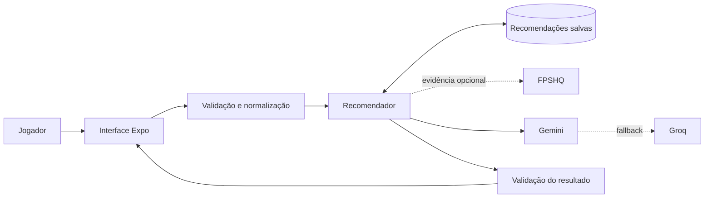
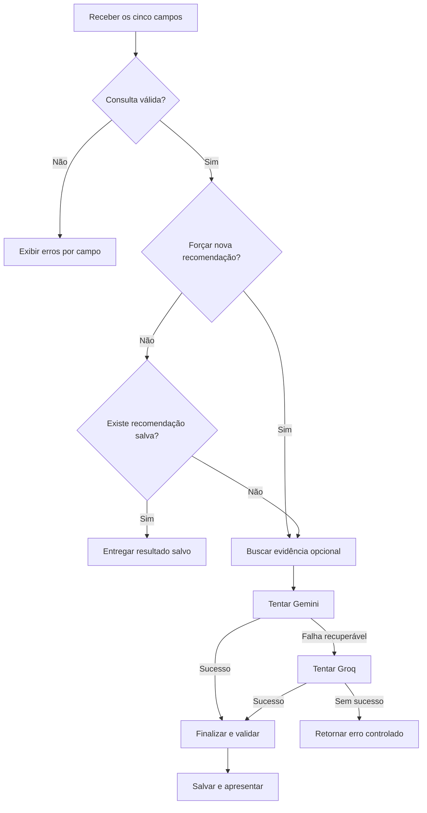
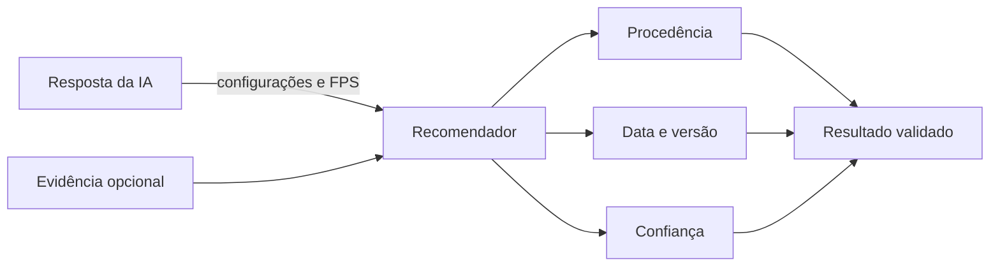

# SettingsCraft

> Sistema multiplataforma para recomendação de configurações gráficas de jogos com apoio de inteligência artificial e evidências de desempenho.

## Resumo

O SettingsCraft é uma aplicação desenvolvida para auxiliar jogadores na escolha de configurações gráficas compatíveis com seu computador. A partir do jogo, placa de vídeo, processador, memória e resolução informados, o sistema valida a consulta e apresenta opções gráficas acompanhadas de justificativas e de uma faixa estimada de quadros por segundo (FPS). Para reduzir chamadas externas e manter consistência entre consultas equivalentes, a solução prioriza recomendações salvas no dispositivo. Quando uma nova geração é necessária, evidências opcionais do FPSHQ são combinadas com modelos de inteligência artificial, utilizando Gemini como fonte principal e Groq como alternativa. O projeto foi construído com Expo, React Native e TypeScript e aplica validação de contratos, persistência local e tolerância a falhas.

**Palavras-chave:** jogos digitais; configurações gráficas; inteligência artificial; desempenho; React Native.

## 1. Introdução

Jogos digitais oferecem diversas opções gráficas, porém a escolha adequada depende da relação entre qualidade visual, resolução e capacidade do hardware. Para usuários sem conhecimento técnico, comparar esses fatores pode ser uma tarefa demorada e sujeita a tentativas e erros.

O SettingsCraft propõe uma interface simples para transformar dados básicos do computador em uma recomendação compreensível. A aplicação não realiza benchmark no dispositivo: ela combina dados informados pelo jogador, evidência externa quando disponível e geração por IA.

### 1.1 Problema de pesquisa

Como apoiar a escolha de configurações gráficas de um jogo, considerando o hardware e a resolução do usuário, sem exigir conhecimento técnico avançado?

## 2. Objetivos

### 2.1 Objetivo geral

Desenvolver uma aplicação multiplataforma capaz de recomendar configurações gráficas de jogos a partir de uma consulta de hardware válida e apresentar a procedência do resultado.

### 2.2 Objetivos específicos

- Validar e normalizar os dados fornecidos pelo jogador.
- Gerar configurações acompanhadas de justificativas e estimativa de FPS.
- Utilizar evidência externa de desempenho sem torná-la obrigatória.
- Reaproveitar recomendações equivalentes salvas no dispositivo.
- Oferecer uma fonte alternativa quando o gerador principal falhar.
- Informar origem, data, confiança e atribuição do resultado.

## 3. Escopo da solução

| Elemento | Descrição |
| --- | --- |
| Entrada | Jogo, placa de vídeo, processador, memória e resolução. |
| Processamento | Validação, busca local, obtenção opcional de evidência e geração por IA. |
| Saída | Opções gráficas, justificativas, faixa estimada de FPS e procedência. |
| Persistência | Hardware lembrado e recomendação mais recente de cada consulta. |
| Plataformas | Android, iOS e Web por meio do Expo. |

Funcionalidades entregues:

- autocomplete de placas de vídeo e processadores, mantendo a possibilidade de texto livre;
- preferência para lembrar hardware e resolução, sem armazenar o jogo nessa preferência;
- histórico das recomendações salvas, ordenado da mais recente para a mais antiga;
- geração forçada de uma nova recomendação para substituir a anterior;
- modo de exemplo local, sem rede e sem consumo de cota dos provedores.

## 4. Metodologia e arquitetura

O desenvolvimento foi organizado em módulos com responsabilidades delimitadas. A interface coleta os dados; o domínio cria uma consulta válida; o recomendador coordena persistência, evidência e fontes de IA; e os schemas validam os dados recebidos antes que sejam apresentados ou salvos.



### 4.1 Fluxo de recomendação



A evidência do FPSHQ apenas orienta a geração. Ela não substitui a recomendação final e sua ausência não impede a tentativa dos provedores de IA.

## 5. Regras de negócio sintetizadas

### 5.1 Consulta e persistência

| Regra | Síntese |
| --- | --- |
| Consulta válida | Os cinco campos são obrigatórios; espaços são normalizados; memória e resolução aceitam somente as opções do sistema. |
| Hardware | GPU e CPU aceitam texto livre; as listas locais servem apenas como sugestões. |
| Identidade | Uma função única gera a identidade estável usada para localizar recomendações equivalentes. |
| Hardware lembrado | Inclui GPU, CPU, memória e resolução, mas nunca o jogo. |
| Recomendação salva | Cada identidade conserva somente o resultado mais recente e não possui prazo de expiração. |
| Nova recomendação | Ignora apenas a leitura local; o resultado novo continua sendo salvo e substitui o anterior. |
| Registro inválido | Conteúdo ilegível ou incompatível é removido e tratado como ausente. |

O histórico é uma visualização das próprias recomendações salvas, não um armazenamento separado.

### 5.2 Ordem e tratamento de falhas

```text
Recomendação salva → Evidência FPSHQ (opcional) → Gemini → Groq
```

| Situação | Comportamento |
| --- | --- |
| Provedor sem credencial | É retirado da cadeia. |
| HTTP 400 ou 401 | Interrompe a cadeia por indicar erro de configuração. |
| HTTP 429 | Permite fallback e gera mensagem específica se nenhuma fonte tiver sucesso. |
| Rede, timeout, HTTP 5xx ou conteúdo inválido | Permite tentar o próximo gerador. |
| Falha no armazenamento | É registrada, mas não invalida uma geração bem-sucedida. |
| Nenhum gerador disponível | Retorna erro controlado para a interface. |

A função `consultarConfiguracoes()` não lança exceções para a tela. Seu retorno informa explicitamente sucesso ou erro.

### 5.3 Evidência e confiança do FPS

| Regra | Síntese |
| --- | --- |
| Orçamento | O FPSHQ possui orçamento total padrão de 3 segundos. |
| Resoluções | 1080p, 1440p e 4K são suportadas; 720p pula essa etapa. |
| Correspondência | Jogo e GPU devem ter um único candidato; CPU ausente ou ambígua permite evidência parcial. |
| Preset | É escolhido o de maior qualidade com FPS mínimo de pelo menos 60; sem atingir a meta, vence o de melhor desempenho. |
| Confiança média | Exige benchmark e correspondência completa, incluindo CPU. |
| Confiança baixa | Aplica-se a predição, correspondência parcial ou ausência de evidência. |

Não existe confiança alta no contrato atual. O campo `fps_min` representa o mínimo informado pela API e não deve ser interpretado como *1% low*.

### 5.4 Composição do resultado



- `fonte` informa de onde o resultado foi obtido na consulta atual: `salvo`, `gemini`, `groq` ou `exemplo`.
- `geradoPor` preserva o gerador original, inclusive quando a recomendação é lida do dispositivo.
- `evidenciaDesempenho` registra a referência do FPSHQ e sua URL de atribuição quando disponível.

## 6. Tecnologias utilizadas

| Camada | Tecnologia |
| --- | --- |
| Aplicação | Expo SDK 54, React Native 0.81 e React 19.1 |
| Navegação | Expo Router 6 com rotas baseadas em arquivos |
| Linguagem | TypeScript em modo estrito |
| Validação | Zod |
| Persistência | AsyncStorage |
| Inteligência artificial | Gemini via REST e Groq via AI SDK |
| Interface e animação | Sistema próprio de estilos e Moti |
| Testes | Test runner do Node.js executado com TSX |

## 7. Organização do projeto

```text
app/                              telas de consulta e histórico
components/                       componentes visuais reutilizáveis
assets/data/hardware.ts           sugestões para o autocomplete
service/
  consulta-configuracoes.ts       criação e identidade da consulta
  hardware-lembrado.ts            preferência persistida de hardware
  armazenamento.ts                porta de armazenamento chave-valor
  ai/
    recomendador-padrao.ts        composição dos adapters
    recomendador.ts               coordenação da cadeia
    recomendacao-salva.ts         persistência das recomendações
    provedor-fpshq.ts             evidência opcional de desempenho
    fonte-gemini.ts               integração REST com Gemini
    fonte-groq.ts                 integração do Groq pelo AI SDK
    schema.ts                     contratos de entrada e saída
    prompt.ts                     instruções comuns aos geradores
styles/                           tokens e estilos compartilhados
```

O alias `@/*` aponta para a raiz do projeto. Os contratos declarados em `service/ai/schema.ts` são a fonte única para validação, inclusive para a geração do JSON Schema utilizado pelo Gemini.

## 8. Execução do projeto

### 8.1 Pré-requisitos

- Node.js 20 ou superior;
- npm;
- ambiente compatível com Expo para a plataforma desejada.

### 8.2 Instalação

```bash
npm install
```

Crie o arquivo `.env.local` na raiz e configure pelo menos um provedor:

```dotenv
EXPO_PUBLIC_GEMINI_API_KEY=sua_chave_aqui
EXPO_PUBLIC_GROQ_API_KEY=sua_chave_aqui
```

As chaves são opcionais individualmente. Para executar a interface sem serviços externos, use:

```dotenv
EXPO_PUBLIC_USAR_RESULTADO_EXEMPLO=true
```

Nesse modo, o gerador local `exemplo` substitui FPSHQ, Gemini e Groq.

### 8.3 Comandos

```bash
npm start          # inicia o Expo
npm run android    # executa no Android
npm run ios        # executa no iOS
npm run web        # executa na Web
npm test           # executa os testes
npm run lint       # realiza a análise estática
npm run typecheck  # verifica os tipos
```

## 9. Verificação e resultados alcançados

O projeto contém testes para validação e identidade da consulta, persistência, schemas, prompts, adapters de IA, recomendador e integração do provedor FPSHQ com massa de dados versionada. Antes de contribuir, execute:

```bash
npm test
npm run lint
npm run typecheck
```

O resultado atual contempla consulta e histórico, reaproveitamento local, fallback entre provedores, modo de exemplo, procedência visível e tratamento controlado das falhas previstas.

## 10. Limitações e segurança

- A estimativa de FPS não substitui um benchmark executado no computador do usuário.
- A qualidade da recomendação depende dos dados informados e das fontes externas disponíveis.
- A versão atual classifica a confiança somente como `media` ou `baixa`.
- O armazenamento local não possui sincronização entre dispositivos nem prazo de expiração.
- Variáveis `EXPO_PUBLIC_*` são incorporadas ao bundle e ficam expostas no cliente. Em produção, as chamadas de IA devem ser movidas para um backend.
- Arquivos `.env.local` e chaves de API não devem ser versionados.

## 11. Uso responsável do FPSHQ

A integração utiliza apenas os endpoints REST documentados e mantém a URL de atribuição recebida. O FPSHQ informa uso justo aproximado de 60 requisições por minuto por IP. Uso comercial ou volume sustentado acima desse limite exige alinhamento prévio com o serviço. Não é realizado *scraping*.

## 12. Considerações finais

O SettingsCraft demonstra uma arquitetura capaz de combinar persistência local, evidência externa e múltiplos provedores de IA sem tornar a interface dependente de uma única fonte. A separação entre consulta, orquestração, contratos e adapters facilita testes e futuras substituições de serviços. Como evolução, o projeto pode adotar um backend para proteger credenciais, sincronizar recomendações e ampliar a avaliação empírica da precisão das estimativas.

## Referências técnicas

- [Documentação do Expo SDK 54](https://docs.expo.dev/versions/v54.0.0/)
- [Documentação do React Native](https://reactnative.dev/docs/getting-started)
- [Documentação do Zod](https://zod.dev/)
- [Documentação do AsyncStorage](https://react-native-async-storage.github.io/async-storage/)
- [Documentação da API do Gemini](https://ai.google.dev/api)
- [Documentação do AI SDK](https://ai-sdk.dev/docs/introduction)
- [Documentação da API do FPSHQ](https://fpshq.com/api-docs/)
